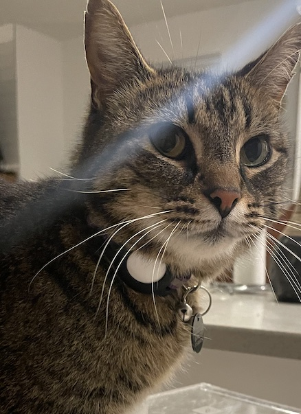
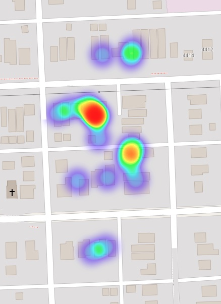
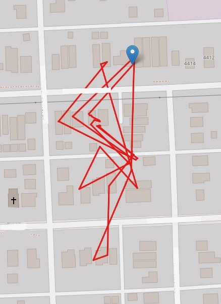

# carl_tracker

This project contains a bash script that collects Apple AirTag data on a regular interval and a Jupyter Notebook for creating maps from that data. I developed this to track my outdoor cat [Carl](https://www.instagram.com/carl37209/).

Dependencies:
- [`jq`](https://formulae.brew.sh/formula/jq)

Credit:
This is based on the work of [AirtagAlex](https://github.com/icepick3000/AirtagAlex)

Disclaimer:
Tracking adheres to [Apple's privacy standards](https://www.apple.com/newsroom/2022/02/an-update-on-airtag-and-unwanted-tracking/) and only user-owned AirTags can be tracked.

 

